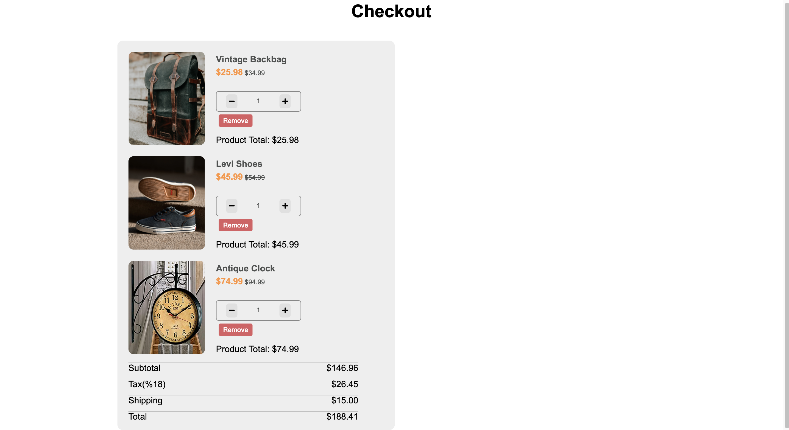

Clarusway

# Project-004 : Checkout_Page (JS-04)

- Project ScreenShot

<<<<<<< HEAD
=======
## Description

- Project aims to create a real checkout page of e-commerce website.

- https://morcicek.github.io/CheckoutProject_JS/
>>>>>>> ba5a1cc (second commit)

## Learning Outcomes

At the end of the this project, students will be able to;

- analyze a problem, create e-commerce website page.

- demonstrate their knowledge of algorithmic design principles for dynamic calculation of product's cart.

## Problem Statement

- You can use [Checkout_Page](<https://github.com/clarusway/clarusway-full-stack-9-21/tree/main/javascript/projects/004-%20Checkout_Page%20(JS-04)/>) template for project.

- Create a checkout page following the design and make the calculation of cart dynamically with using of DOM and Event in JS.

- Template similar to this: [Checkout_Form](https://github.com/clarusway/clarusway-full-stack-9-21/tree/main/html-css/projects/004-checkout-form/)

* User story;

  - When I click plus button on product's row, I can increase the product's quantity.
  - When I click minus button on product's row, I can decrease the product's quantity, but minimum quantity value can be 1.
  - When I click remove button on product's row, I can delete a product in the cart.
  - When I change any combination of product chart(plus, minus, remove etc.), I want to see the new calculation of chart's prices in concerned fields.

🔥 You don’t need to create a new html template in this project, you can use [Checkout_Page](<https://github.com/clarusway/clarusway-full-stack-9-21/tree/main/javascript/projects/004-%20Checkout_Page%20(JS-04)/>) template. We will be concerned in javascript side.

## Resources

- [Images](./img)
